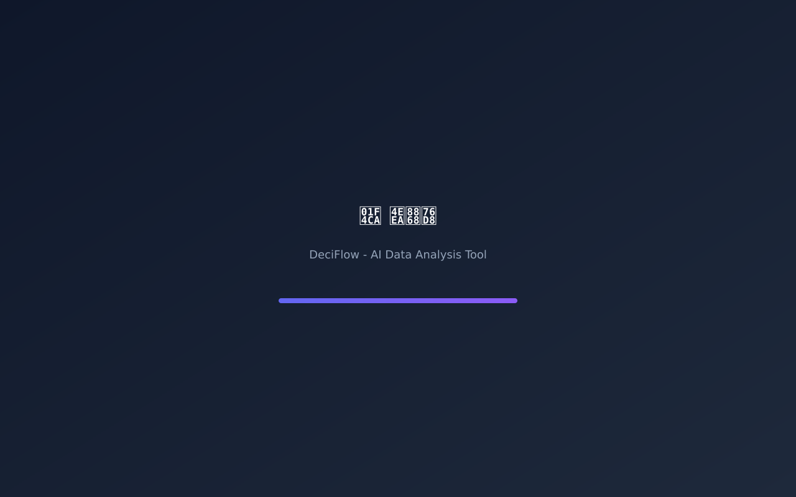
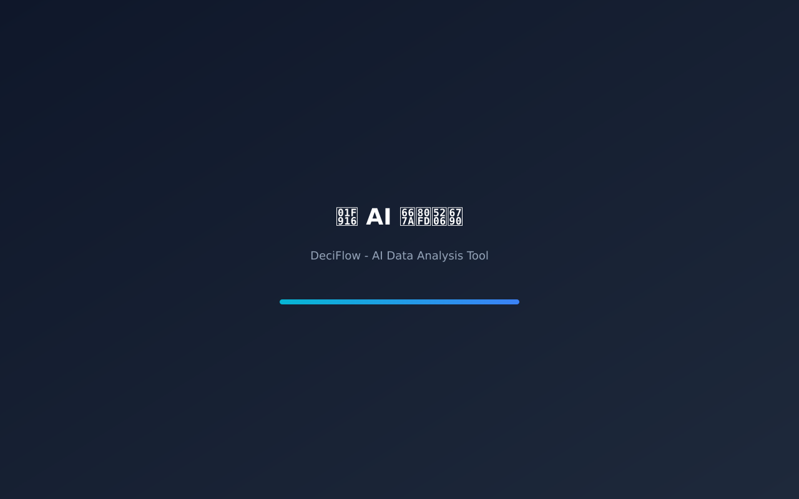
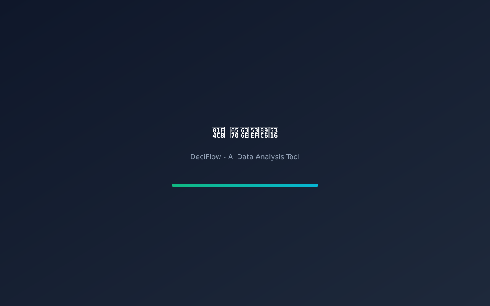

<div align="center">


# DeciFlow

**AI 驱动的数据分析工具，让数据洞察触手可及**

[](https://github.com/Terry-iotex/deciflow-src)
[](https://www.electronjs.org/)
[](https://react.dev/)
[](https://www.typescriptlang.org/)

</div>

---

## ✨ 功能特性

- **🤖 AI 智能分析** - 自然语言查询，自动生成 SQL，智能洞察发现
- **📊 丰富可视化** - 多种图表类型，一键切换，拖拽交互
- **🔌 多数据源支持** - PostgreSQL、MySQL、MongoDB 一键连接
- **📖 数据字典** - 统一管理业务指标和字段定义
- **🔒 安全可靠** - SQL 注入防护，数据脱敏，审计日志
- **🎨 精美设计** - 深色/浅色主题，响应式布局，流畅动画

---

## 🖼️ 界面预览

### 主界面


### AI 分析


### 数据可视化


---

## 📥 下载安装

> **🎯 快速下载：访问 [Releases 页面](https://github.com/Terry-iotex/data-insight-pro/releases) 获取最新版本**

### 🍎 macOS

**支持 macOS 10.15+ (Intel & Apple Silicon M1/M2/M3)**

| 文件 | 说明 | 下载 |
|------|------|------|
| `DeciFlow-1.0.0-universal.dmg` | 通用安装包（推荐） | [下载](https://github.com/Terry-iotex/data-insight-pro/releases/latest) |

**安装步骤：**
1. 下载 `.dmg` 文件
2. 双击打开，将 DeciFlow 拖入「应用程序」文件夹
3. 首次打开时，右键点击 → 选择「打开」（绕过 Gatekeeper）

**⚠️ 提示**：如果遇到「无法验证开发者」错误，请在系统偏好设置 → 安全性与隐私中点击「仍要打开」

---

### 🪟 Windows

**支持 Windows 10/11 (64 位)**

| 文件 | 说明 | 下载 |
|------|------|------|
| `DeciFlow-Setup-1.0.0.exe` | 安装程序（推荐） | [下载](https://github.com/Terry-iotex/data-insight-pro/releases/latest) |

**安装步骤：**
1. 下载 `.exe` 安装程序
2. 运行安装程序，按提示完成安装
3. 从桌面快捷方式或开始菜单启动 DeciFlow

---

## 🚀 快速开始

### 1. 连接数据源

首次使用时，需要连接你的数据库：

1. 点击左侧「数据源」
2. 选择数据库类型（PostgreSQL / MySQL / MongoDB）
3. 填写连接信息
4. 点击「测试连接」
5. 连接成功后点击「保存」

### 2. 开始查询

在首页输入框中输入自然语言查询：

```
"查询过去30天的用户增长趋势"
"分析上周各渠道的转化率"
"找出销售额下降的原因"
```

### 3. 探索洞察

- **AI 洞察** - 自动发现数据中的模式和异常
- **可视化** - 一键生成图表，支持拖拽调整
- **导出** - 导出为 CSV、JSON 或图片

---

## 📚 使用文档

详细使用文档请访问：[Wiki](https://github.com/Terry-iotex/data-insight-pro/wiki)

---

## 🔒 源代码

DeciFlow 的源代码托管在私有仓库中。

如需访问源代码或参与开发，请联系：[terry@iotex.io](mailto:terry@iotex.io)

---

## 🛠️ 技术栈

- **前端**: React 19 + TypeScript + Tailwind CSS
- **桌面**: Electron 41
- **图表**: Recharts
- **构建**: Vite + electron-builder
- **AI**: OpenAI / Claude / Gemini (可选)

---

## 📄 许可证

Proprietary - © 2025 Terry

---

## 🙏 致谢

- [Electron](https://www.electronjs.org/)
- [React](https://react.dev/)
- [Recharts](https://recharts.org/)
- [Lucide Icons](https://lucide.dev/)

---

<div align="center">

**Made with ❤️ by [Terry](https://github.com/Terry-iotex)**

[官网](https://datainsight.pro) · [文档](https://docs.datainsight.pro) · [反馈](https://github.com/Terry-iotex/data-insight-pro/issues)

</div>
